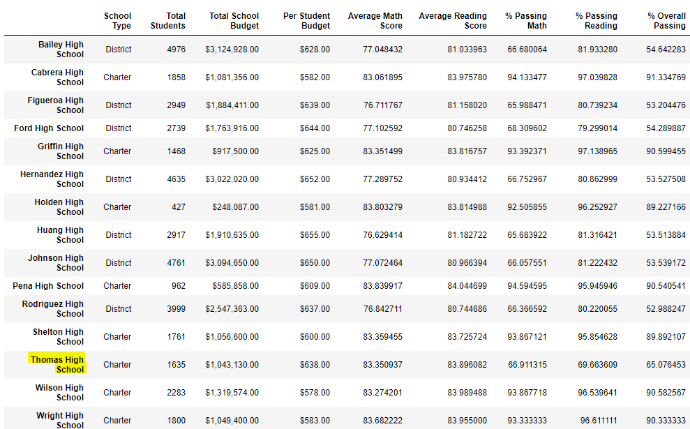
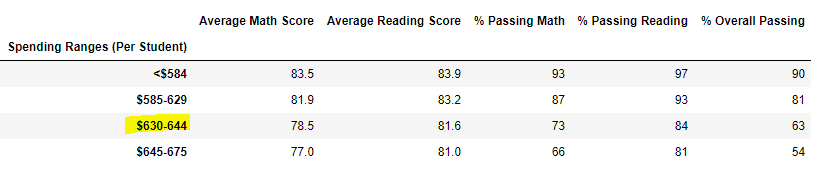
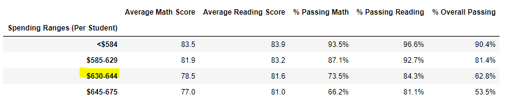
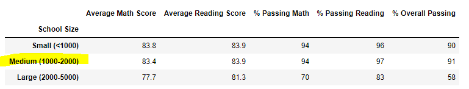
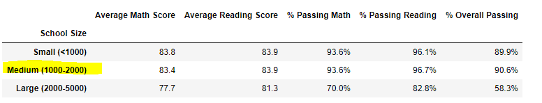
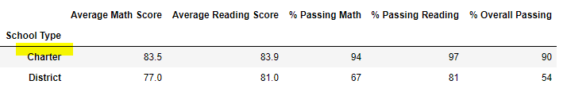
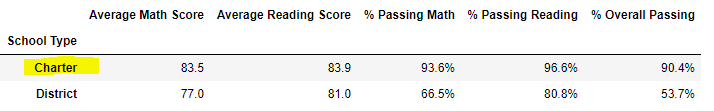

# School District Analysis

## Overview of Project
The overall objective of this project is to prepare several key performance metrices related to the 15 schools and 40,000 students within the district. Additionally, the school board had requested to evaluated the potential for Thomas High School to be tempering with 9th grade student test results, which would be a violation aganist the state testing standards. To accomplish this goal, the analysis will be comparing Thomas High School's key performance matices before and after the potentially tempered results had been removed to identify clues that could gove weight to the claim of violation.

## Results of the Analysis
1. District-Level Summary: A slight decrease in all key test averages (except average reading scores) can be observed once potentially tempered results has been removed. 

#### With All Test Results

#### With Thomas High School's 9th Grade Results Removed 

2. School-Level Summary: Similarly, slight decrease in all key test averages can be observed once potentially tempered results has been removed. 

#### With All Test Results

#### With Thomas High School's 9th Grade Results Removed 

3. Thomas High School vs Other School in the District: Based on the screenshot presented above, it can be point out that Thomas High School's test results generally outperformed majority of all other schools, regardless if the potentially tempered results were included or removed during the analysis.

 4A. Math and Reading Scores by Grade: Removing the ninth grades school of Thomas High School does not impact the analysis, because performance from all grade level were seperated out. 

 4B. Scores by School Spending: Removing the ninth grades school of Thomas High School does not impact the analysis based on school spending.

#### With All Test Results

#### With Thomas High School's 9th Grade Results Removed 

4C. Scores by School Size: Removing the ninth grades school of Thomas High School does not impact the analysis based on school size.

#### With All Test Results

#### With Thomas High School's 9th Grade Results Removed 

4D. Scores by School Type: Removing the ninth grades school of Thomas High School does not impact the analysis based on school Type.

#### With All Test Results

#### With Thomas High School's 9th Grade Results Removed 

## Summary of the Analysis
In conclusion, the above analysis has demonstrated that removing  the ninth grades school of Thomas High School does not have a huge impact on majority of the performance metrix. However, there are four change that we can point out:
1. Reduced average math score of THS from 83.41 to 83.36 
2. Increased average reading score of THS from 83.85 to 83.90
3. Reduced % passing math of THS from 93.27% to 93.19%
4. Reduced % passing reading of THS from 97.31% to 97.02%

