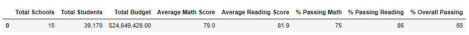

# School District Analysis

## Overview of Project
The overall objective of this project is to prepare several key performance metrices related to the 15 schools and 40,000 students within the district. Additionally, the school board had requested to evaluated the potential for Thomas High School to be tempering with 9th grade student test results, which would be a violation aganist the state testing standards. To accomplish this goal, the analysis will be comparing Thomas High School's key performance matices before and after the potentially tempered results had been removed to identify clues that could gove weight to the claim of violation.

## Results of the Analysis
1. District-Level Summary: A slight decrease in all key test averages (except average reading scores) can be observed once potentially tempered results has been removed. 

### With All Test Results

### With Thomas High School's 9th Grade Results Removed 

2. School-Level Summary:

### With All Test Results

### With Thomas High School's 9th Grade Results Removed 
